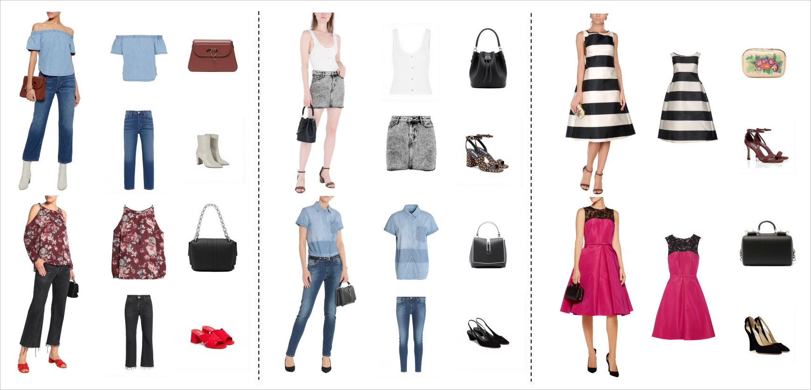
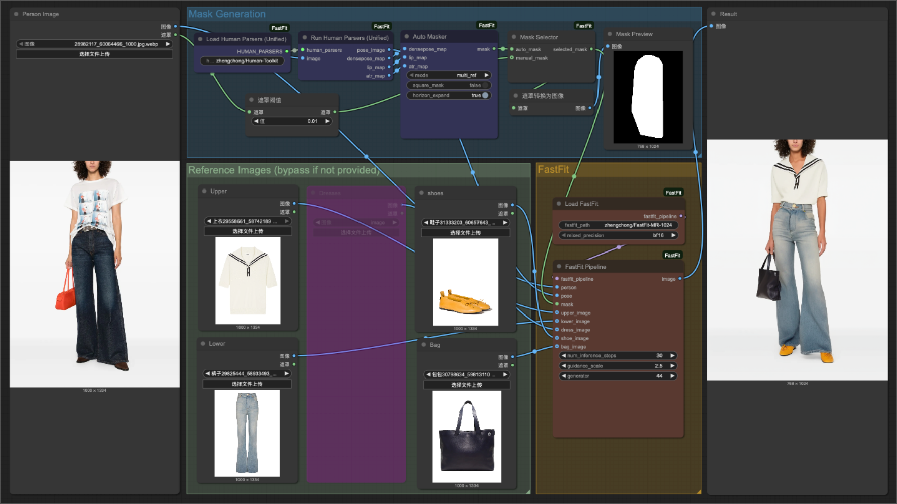

<h1 align="center"> FastFit: Accelerating Multi-Reference Virtual Try-On via Cacheable Diffusion Models </h1>

<p align="center" style="font-size: 18px;">Supported by <a href="https://lavieai.com/">LavieAI</a> and <a href="https://www.loomlyai.com/en">LoomlyAI</a></p>            


 <div align="center">
  <a href="https://github.com/Zheng-Chong/FastFit" style="margin: 0 2px; text-decoration: none;">
    
  </a>
  <a href='https://huggingface.co/zhengchong/FastFit-MR-1024' style="margin: 0 2px; text-decoration: none;">
    
  </a>
  <a href="https://github.com/Zheng-Chong/FastFit" style="margin: 0 2px; text-decoration: none;">
    
  </a>
  <a href="https://fastfit.lavieai.com" style="margin: 0 2px; text-decoration: none;">
    
  </a>
  <a href='https://zheng-chong.github.io/FastFit/' style="margin: 0 2px;">
    
  </a>
  <a href="https://github.com/Zheng-Chong/FastFit/tree/main" style="margin: 0 2px; text-decoration: none;">
    
  </a>
</div>

<br>

FastFit is a diffusion-based framework optimized for **high-speed**, **multi-reference virtual try-on**. It enables **simultaneous try-on of multiple fashion items**—such as **tops, bottoms, dresses, shoes, and bags**—on a single person. The framework leverages **reference KV caching** during inference to **significantly accelerate generation**.
 
## Updates 
- **`2025/08/06`**: ⚙️ We release [the code for inference and evaluation](https://github.com/Zheng-Chong/FastFit/blob/main/infer_datasets.py) on the [DressCode-MR](https://huggingface.co/datasets/zhengchong/DressCode-MR), [DressCode](https://huggingface.co/datasets/zhengchong/DressCode-Test), and [VITON-HD](https://huggingface.co/datasets/zhengchong/VITON-HD) test datasets.
- **`2025/08/05`**: 🧩 We release the [ComfyUI workflow](https://github.com/Zheng-Chong/FastFit/releases/tag/comfyui) for FastFit!
- **`2025/08/04`**: 🚀 Our [gradio demo](https://fastfit.lavieai.com) is online with Chinese & English support!  The code of the demo is also released in [app.py](app.py).
- **`2025/07/03`**: 🎉 We release the weights of [FastFit-MR](https://huggingface.co/zhengchong/FastFit-MR-1024) and [FastFit-SR](https://huggingface.co/zhengchong/FastFit-SR-1024) model on Hugging Face!
- **`2025/06/24`**: 👕 We release [DressCode-MR](https://huggingface.co/datasets/zhengchong/DressCode-MR) dataset with **28K+ Multi-reference virtual try-on Samples** on Hugging Face!


## DressCode-MR Dataset

<div align="center">
  
</div>

[DressCode-MR](https://huggingface.co/datasets/zhengchong/DressCode-MR) is constructed based on the [DressCode](https://github.com/aimagelab/dress-code) dataset with **28K+ Multi-reference virtual try-on Samples**.

- **Multi-reference Samples**: Each sample comprises a person's image paired with a set of compatible clothing and accessory items: tops, bottoms, dresses, shoes, and bags.
- **Large Scale**: Contains a total of 28,179 high-quality multi-reference samples with 25,779 for training and 2,400 for testing.

DressCode-MR is released under the exact same license as the original DressCode dataset. Therefore, before requesting access to DressCode-MR dataset, you must complete the following steps:

1. Apply and be granted a license to use the [DressCode](https://github.com/aimagelab/dress-code) dataset. 
2. Use your educational/academic email address (e.g., one ending in .edu, .ac, etc.) to request access to [DressCode-MR](https://huggingface.co/datasets/zhengchong/DressCode-MR) on Hugging Face. (Any requests from non-academic email addresses will be rejected.)

## Installation

```bash
conda create -n fastfit python=3.10
conda activate fastfit
pip install -r requirements.txt
pip install huggingface-hub==0.30.0  # to resolve the version conflict
```

## ComfyUI Workflow

<div align="center">
  
</div>

1.  Download the `FastFit.zip` file from the [release page](https://github.com/Zheng-Chong/FastFit/releases/tag/comfyui).
2.  Extract the contents of the zip file into your `ComfyUI/custom_nodes/` directory.
3.  Install the required dependencies following：
    ```bash
    cd  Your_ComfyUI_Dir/custom_nodes/FastFit
    pip install -r requirements.txt
    pip install huggingface-hub==0.30.0  # to resolve the version conflict
    ```
4.  Restart ComfyUI.
5.  Drag and drop the `FastFit.json` file from the [release page](https://github.com/Zheng-Chong/FastFit/releases/tag/comfyui) onto the ComfyUI web interface.

## Gradio Demo

The model weights will be automatically downloaded from Hugging Face when you run the demo.

```bash
python app.py
```

## Inference & Evaluation on Datasets

To perform inference on the [DressCode-MR](https://huggingface.co/datasets/zhengchong/DressCode-MR), [DressCode](https://huggingface.co/datasets/zhengchong/DressCode-Test), or [VITON-HD](https://huggingface.co/datasets/zhengchong/VITON-HD) test datasets, use the `infer_datasets.py` script, for example:

```bash
python infer_datasets.py \
    --dataset <dataset_name> \
    --data_dir </path/to/your/dataset> \
    --batch_size 4 \
    --num_inference_steps 50 \
    --guidance_scale 2.5 \
    --mixed_precision bf16 \
    --paired
```

- `--dataset`: Specify the target dataset. Choose from `dresscode-mr`, `dresscode`, or `viton-hd`.

- `--data_dir`: The root directory path for the specified dataset.

- `--paired`: Include this flag to run inference in the paired setting. Omit this flag for the unpaired setting.

By default, inference results will be saved to the `results/` directory at the project root.

---

After inference, use the `eval.py` script to ecalculate the evaluation metrics:

```bash
python eval.py \
    --gt_folder </path/to/ground_truth_folder> \
    --pred_folder </path/to/prediction_folder> \
    --paired \
    --batch_size 16 \
    --num_workers 4
```

- `--gt_folder`: The directory path containing the ground truth images.

- `--pred_folder`: The directory path containing the generated (predicted) images from the inference step.

- `--paired`: Include this flag to evaluate results from the paired setting. Omit this flag for the unpaired setting.

<!-- ## Citation

```bibtex

``` -->

## Acknowledgement
Our code is modified based on [Diffusers](https://github.com/huggingface/diffusers). We adopt [Stable Diffusion v1.5 inpainting](https://huggingface.co/runwayml/stable-diffusion-inpainting) as the base model. We use a modified [AutoMasker](https://github.com/Zheng-Chong/CatVTON/blob/edited/model/cloth_masker.py) to automatically generate masks in our [Gradio](https://github.com/gradio-app/gradio) App and [ComfyUI](https://github.com/comfyanonymous/ComfyUI) workflow. Thanks to all the contributors!

## License

All weights, parameters, and code related to FastFit are governed by the [FastFit Non-Commercial License](https://github.com/Zheng-Chong/FastFit/tree/main). For commercial collaboration, please contact [LavieAI](https://lavieai.com/) or [LoomlyAI](https://www.loomlyai.com/en).